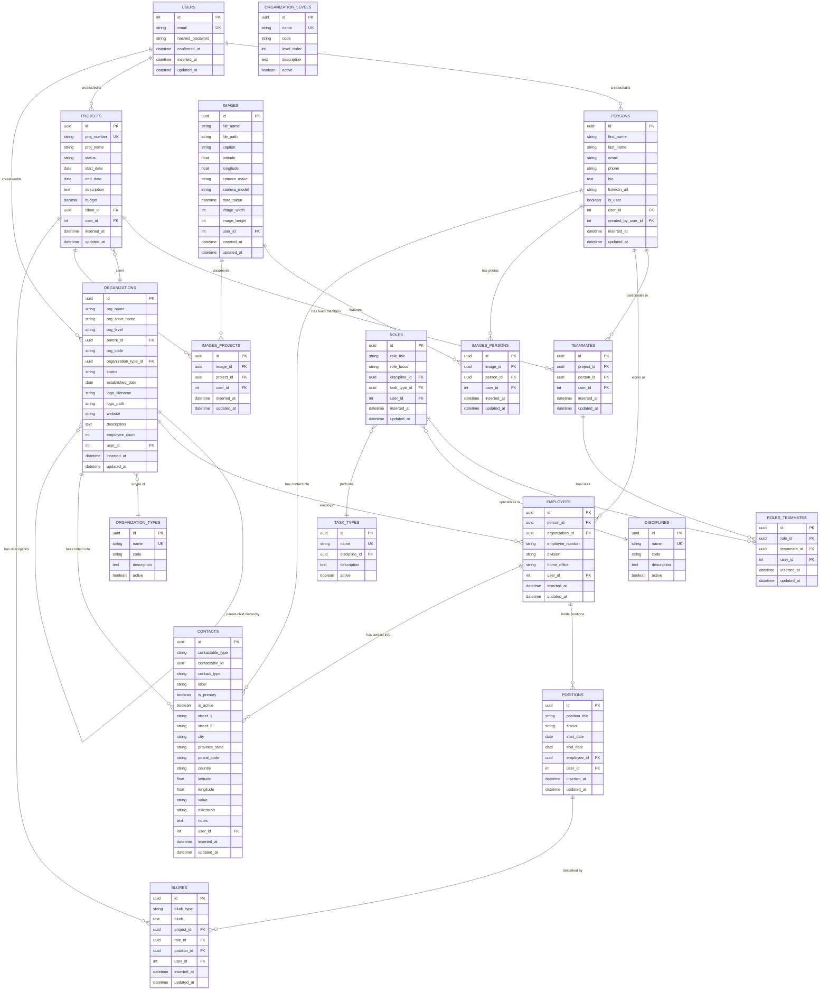

# Data Model & Schema Documentation

## Overview
This application manages professional services projects, team members, client relationships, and organizational data. It tracks project teams, individual roles and responsibilities, client information, and creates detailed profiles for team members and their professional experience. The system supports project portfolio management with detailed team member prof- **Notes**: Pre-populated with: "Company", "Federal Government", "Provincial Government", "Regional Government", "Municipal Government", "First Nation", "Community Group"

### Schema: [OrganizationLevels] (Dali.Lookups.OrganizationLevel)
- **Table**: `organization_levels`
- **Primary Key**: `:id` (type: `:binary_id`)
- **Context**: `Lookups`
- **Fields**:
  - `name` - `:string` - Required, unique (e.g., "Parent", "Subsidiary", "Branch", "Division", "Department")
  - `code` - `:string` - Short code (e.g., "PAR", "SUB", "BRA", "DIV", "DEP")
  - `level_order` - `:integer` - Hierarchical ordering (1=highest, 5=lowest)
  - `description` - `:text` - Description of this organizational level
  - `active` - `:boolean` - Default true
- **Notes**: Defines the types of organizational hierarchy levels

### Schema: [Contacts] (Dali.Contacts.Contact)
#### Purpose: Universal contact information table for addresses, phone numbers, emails for persons, employees, and organizations. Uses polymorphic associations to link to different entity types.

- **Table**: `contacts`
- **Primary Key**: `:id` (type: `:binary_id`)
- **Context**: `Contacts`
- **Fields**:
  - `contactable_type` - `:string` - Polymorphic type ("Person", "Employee", "Organization")
  - `contactable_id` - `:binary_id` - Polymorphic foreign key
  - `contact_type` - `:string` - Enum: "address", "phone", "email", "website", "social"
  - `label` - `:string` - Label for contact (e.g., "Home", "Work", "Billing", "Mailing")
  - `is_primary` - `:boolean` - Default false, marks primary contact for type
  - `is_active` - `:boolean` - Default true, allows soft disable
  
  **Address Fields** (when contact_type = "address"):
  - `street_1` - `:string` - Primary street address
  - `street_2` - `:string` - Optional secondary address line
  - `city` - `:string` - City name
  - `province_state` - `:string` - Province/State
  - `postal_code` - `:string` - Postal/ZIP code
  - `country` - `:string` - Country name or code
  - `latitude` - `:float` - GPS coordinates (optional)
  - `longitude` - `:float` - GPS coordinates (optional)
  
  **Communication Fields** (when contact_type = "phone", "email", "website", "social"):
  - `value` - `:string` - Phone number, email address, URL, or social handle
  - `extension` - `:string` - Phone extension (when applicable)
  
  **Metadata**:
  - `notes` - `:text` - Optional notes about this contact
  - `user_id` - `:id` - Foreign key to users (who created/edited)
  - `inserted_at` - `:utc_datetime` - Auto-generated
  - `updated_at` - `:utc_datetime` - Auto-generated

- **Associations**:
  - `belongs_to :user` - Foreign key: `user_id`
  - Polymorphic associations (contactable):
    - `belongs_to :person` - When contactable_type = "Person"
    - `belongs_to :employee` - When contactable_type = "Employee" 
    - `belongs_to :organization` - When contactable_type = "Organization"

- **Indexes**:
  - Composite index on `contactable_type, contactable_id`
  - Index on `contact_type`
  - Index on `is_primary, contact_type` for finding primary contacts

- **Constraints**:
  - Check constraint: contact_type in ["address", "phone", "email", "website", "social"]
  - Unique constraint on (contactable_type, contactable_id, contact_type, is_primary) WHERE is_primary = true
  - Address fields required when contact_type = "address"
  - Value field required when contact_type != "address"

- **Notes**: 
  - Only one primary contact per type per entity
  - Supports multiple addresses, phones, emails per entity
  - Polymorphic design allows easy extension to other entity types
  - Geographic coordinates support mapping functionality

## Association Maples and project documentation.

## Schemas & Relationships

### Schema: Users (Dali.Accounts.User)
#### Purpose: Authentication and authorization of users of the application
  - other schemas will use user relationship to track who made various changes

- **Table**: `users`
- **Primary Key**: `:id` (type: `:id` | `:binary_id`)
- **Context**: `Accounts`
- **Fields**:
  - `email` - `:string` - Unique, required
  - `hashed_password` - `:string` - Required
  - `confirmed_at` - `:naive_datetime` - Email confirmation timestamp
  - `inserted_at` - `:utc_datetime` - Auto-generated
  - `updated_at` - `:utc_datetime` - Auto-generated
- **Associations**:
  - `has_many :persons` - Foreign key: `user_id`
  - <!-- Add other associations here -->
- **Indexes**: 
  - Unique index on `email`
- **Constraints**: 
  - Email format validation
  - Password strength requirements
- **Notes**: Generated by phx.gen.auth

### Schema: Persons (Dali.People.Person)
#### Purpose: lists persons and their individual information including education, professional affiliations, contact information, employment history, current and former roles. Also tracks the user_id through the current_user scope to identify user creating or editing records.


- **Table**: `persons`
- **Primary Key**: `:id` (type: `:binary_id`)
- **Context**: `People`
- **Fields**:
  - `first_name` - `:string` - Required
  - `last_name` - `:string` - Required
  - `email` - `:string` - Optional, person's professional email
  - `phone` - `:string` - Optional, contact phone number
  - `bio` - `:text` - Optional, professional biography
  - `linkedin_url` - `:string` - Optional, LinkedIn profile URL
  - `is_user` - `:boolean` - Default false, true if person has user account
  - `user_id` - `:id` - Foreign key to users (tracks who created/edited)
  - `created_by_user_id` - `:id` - Foreign key to users (who created this record)
  - `inserted_at` - `:utc_datetime` - Auto-generated
  - `updated_at` - `:utc_datetime` - Auto-generated
- **Associations**:
  - `belongs_to :user` - Foreign key: `user_id` (who created/edited)
  - `belongs_to :created_by_user, User` - Foreign key: `created_by_user_id`
  - `has_many :teammates` - Foreign key: `person_id`
  - `has_many :projects` - Through: `:teammates`
  - `has_many :employees` - Foreign key: `person_id`
  - `has_many :organizations` - Through: `:employees`
  - `has_many :images_persons` - Foreign key: `person_id`
  - `has_many :images` - Through: `:images_persons`
  

- **Indexes**: 
  - Index on `user_id`
- **Constraints**: 
  - Foreign key constraint on `user_id`
- **Notes**: Each person belongs to a user

***Changes to schema required*** 
the Person may be a User, but not necesarily. We also need a field that will be related to the user_id field to track which user created or changed user information


### Schema: [Projects] (Dali.Projects.Project])
#### Purpose: lists projects, and includes the project team, blurbs about the project as a whole and blurbs for each discipline, as well as pics and videos for the project. Also tracks the user_id through the current_user scope to identify user creating or editing records.

- **Table**: `projects`
- **Primary Key**: `:id` (type: `:id` | `:binary_id`)
- **Context**: `Projects`
- **Fields**:
  - `proj_number` - `:string` - Company assigned project number/Required, unique
  - `proj_name` - `:string` - Required
  - `status` - `:string` - Enum: "Active", "Inactive", "Completed"
  - `start_date` - `:date` - Start date of the project
  - `end_date` - `:date` - End date of the project; only if completed
  - `description` - `:text` - Project overview description
  - `budget` - `:decimal` - Optional project budget
  - `client_id` - `:binary_id` - Foreign key to organizations (client)
  - `user_id` - `:id` - Foreign key to users (tracks who created/edited)
  - `inserted_at` - `:utc_datetime` - Auto-generated
  - `updated_at` - `:utc_datetime` - Auto-generated

- **Associations**:
  - `has_many :persons` - Through: `Dali.Projects.Teammate`
  - `belongs_to :client` - Foreign Key: `client_id`
  - `has_many :blurbs` - Through: `:blurb_projects`
  - `has_many :images` - Through: `images_projects`
  -   


  - `has_many :persons` - Through: `:teammates` table
- **Indexes**: 
  - List any special indexes beyond foreign keys
- **Constraints**: 
  - Unique constraints, check constraints, etc.
- **Notes**: Any special business logic or considerations

### Schema: [Teammates] ([Dali.Projects.Teammate])
  ####Purpose: Join table between Projects and Persons, with additional informaiton about the individuals role, responsibilities, discipline, tools used, etc. Also tracks the user_id through the current_user scope to identify user creating or editing records. Can only be created through the teammates form.
<!-- Copy this template for each additional schema -->
- **Table**: `teammates`
- **Primary Key**: `:id` (type: `:id` | `:binary_id`)
- **Context**: `ContextName`
- **Fields**:
  - `project_id` - `:uuid` - Link to projects.  Required
  - `person_id` - `:uuid` - link to persons table. Required
  
  - `inserted_at` - `:utc_datetime` - Auto-generated
  - `updated_at` - `:utc_datetime` - Auto-generated

- **Associations**:
  - `has_many :roles` - Through - `roles_teammates` table
  - `belongs_to :project` - Foreign Key - `project_id` table
  - `belongs_to :person` - Foreign Key - `person_id` table
  

 
  **Indexes**: 
  - List any special indexes beyond foreign keys
- **Constraints**: 
  - Unique constraints, check constraints, etc.
- **Notes**: Any special business logic or considerations


### Schema: [Roles] ([Dali.Projects.Role])
  #### Purpose: Join table between Projects and Persons, with additional informaiton about the individuals role, responsibilities, discipline, tools used, etc. Also tracks the user_id through the current_user scope to identify user creating or editing records. Can only be created through the teammates form.

- **Table**: `roles`
- **Primary Key**: `:id` (type: `:id` | `:binary_id`)
- **Context**: `Projects`
- **Fields**:
  - `role_title` - `:string` - Description/validation rules
  - `role_focus` - `:string` - Discribes the focus of the role in the project. Captures is individual has two roles, like Project Manager(primary) as well as Techincal Lead    (secondary) can be either Primary, Secondary, Other
  - `discipline` - `:string` - can either be a lookup table or an Enum, 
  - `tasks` - `:string` - can be a lookup or an Enum


  - `` - `:type` - Description/validation rules
  - `` - `:string` - Optional/Required, constraints


  - `user_id` - `:id` | `:binary_id` - References user table to track creation/edits
  
  - `inserted_at` - `:utc_datetime` - Auto-generated
  - `updated_at` - `:utc_datetime` - Auto-generated

- **Associations**:
  - `belongs_to :teammate` - Foreign key: `teammate_id`
  - `has_many :blurbs` - Through: `:blurbs_roles`

- **Indexes**: 
  - List any special indexes beyond foreign keys
- **Constraints**: 
  - Unique constraints, check constraints, etc.
- **Notes**: Any special business logic or considerations


### Schema: [Media] ([Dali.Media.Image])
  #### Purpose: table to hold image information for all schema --- joined through join tables. Also tracks the user_id through the current_user scope to identify user creating or editing records. 

- **Table**: `images`
- **Primary Key**: `:id` (type: `:id` | `:binary_id`)
- **Context**: `ContextName`
- **Fields**:
  - `file_name` - `:string` - Image file name
  - `file_path` - `:string` - Image file path
  - `caption`   -   `:string` - Image caption -- user entered

**EXIF data extracted**
  - `latitude` - `:float` - GPS coordinates in decimal degrees
  - `longitude` - `:float` - GPS coordinates in decimal degrees
  - `camera_make` - `:string` - Camera manufacturer (e.g., "Canon", "Nikon")
  - `camera_model` - `:string` - Camera model (e.g., "EOS R5", "D850")
  - `lens_model` - `:string` - Lens information
  - `focal_length` - `:string` - Focal length (e.g., "85mm")
  - `aperture` - `:string` - F-stop value (e.g., "f/2.8")
  - `shutter_speed` - `:string` - Shutter speed (e.g., "1/125")
  - `iso` - `:integer` - ISO sensitivity
  - `date_taken` - `:utc_datetime` - When photo was taken
  - `image_width` - `:integer` - Image width in pixels
  - `image_height` - `:integer` - Image height in pixels
  - `file_size` - `:integer` - File size in bytes
  - `orientation` - `:integer` - Image orientation (1-8)  


  - `inserted_at` - `:utc_datetime` - Auto-generated
  - `updated_at` - `:utc_datetime` - Auto-generated

- **Associations**:
  - `belongs_to :persons` - Through: `images_persons` table
  - `belongs_to :projects` - Through: `images_projects` table


- **Indexes**: 
  - List any special indexes beyond foreign keys
- **Constraints**: 
  - Unique constraints, check constraints, etc.
- **Notes**: Any special business logic or considerations


### Schema: [Organizations] ([Dali.Organizations.Organization])
#### Purpose: Hierarchical organization structure supporting parent companies with multiple branches, regions, divisions, or subsidiaries. Also tracks the user_id through the current_user scope to identify user creating or editing records.

- **Table**: `organizations`
- **Primary Key**: `:id` (type: `:binary_id`)
- **Context**: `Organizations`
- **Fields**:
  - `org_name` - `:string` - Organization name (Required)
  - `org_short_name` - `:string` - Abbreviated name or acronym
  - `org_level` - `:string` - Enum: "parent", "subsidiary", "branch", "division", "department"
  - `parent_id` - `:binary_id` - Self-referencing foreign key to parent organization
  - `org_code` - `:string` - Internal organization code/identifier
  - `organization_type_id` - `:binary_id` - Foreign key to organization_types lookup
  - `status` - `:string` - Enum: "active", "inactive", "merged", "acquired"
  - `established_date` - `:date` - When organization was established
  - `logo_filename` - `:string` - Logo file name
  - `logo_path` - `:string` - Logo file path
  - `website` - `:string` - Primary website URL
  - `description` - `:text` - Organization description
  - `employee_count` - `:integer` - Approximate number of employees
  - `user_id` - `:id` - Foreign key to users (who created/edited)
  - `inserted_at` - `:utc_datetime` - Auto-generated
  - `updated_at` - `:utc_datetime` - Auto-generated

- **Associations**:
  - `belongs_to :parent, Organization` - Foreign key: `parent_id`
  - `has_many :children, Organization` - Foreign key: `parent_id`
  - `belongs_to :organization_type` - Foreign key: `organization_type_id`
  - `belongs_to :user` - Foreign key: `user_id`
  - `has_many :employees` - Foreign key: `organization_id`
  - `has_many :persons` - Through: `employees`
  - `has_many :projects` - Foreign key: `client_id` (as client)
  - `has_many :contacts` - As contactable (polymorphic)
  
  **Hierarchical Queries**:
  - `has_many :all_descendants` - Recursive: all child organizations at any level
  - `has_many :all_ancestors` - Recursive: all parent organizations up the chain

- **Indexes**: 
  - List any special indexes beyond foreign keys
- **Constraints**: 
  - Unique constraints, check constraints, etc.
- **Notes**: Any special business logic or considerations


### Schema: [Position] ([Dali.Organizations.Position])
  #### Purpose: Similar to the 'role' table for projects, position refers to the job the employee is doing in the organization. It has start and end dates since an employee can change roles over time. Also tracks the user_id through the current_user scope to identify user creating or editing records.  

- **Table**: `position`
- **Primary Key**: `:id` (type: `:id` | `:binary_id`)
- **Context**: `ContextName`
- **Fields**:
  - `org_name` - `:string` - Organizaiton name.
  - `org_type` - `:string` - Enum over org_type lookup. Includes Company, Federal Governement, Provincial Government, Regional Governemnt, Municipal Government, First      - 
  Nation, Commununity Group
  - `status` - `:string` - Enum or look-up.  With either be "Current" or "Former" and end_date is only active if the status = "Former" 
  - `start_date` - `:date` - Start date of position.
  - `end_date` - `:date` - End date of position.
  

  - `inserted_at` - `:utc_datetime` - Auto-generated
  - `updated_at` - `:utc_datetime` - Auto-generated

- **Associations**:
  - `belongs_to :Can only be created through the teammates form.employee` - foreign_key: `Dali.Organizations.Employee`
  - `has_many :blurbs` - foreign_key: `Dali.Descriptions.Blurb`  - A descriptions of the roles and responsibilities of the position.

- **Indexes**: 
  - List any special indexes beyond foreign keys
- **Constraints**: 
  - Unique constraints, check constraints, etc.
- **Notes**: Any special business logic or considerations


### Schema: [clients] ([Dali.Organizations.Clients])
#### Purpose: Join table between projects and organizations. Also tracks the user_id through the current_user scope to identify user creating or editing records.

- **Table**: `employees`
- **Primary Key**: `:id` (type: `:id` | `:binary_id`)
- **Context**: `ContextName`
- **Fields**:
  `client_contact` - `id` - Lookup from the employees table filtered to client_org 
 


  - `inserted_at` - `:utc_datetime` - Auto-generated
  - `updated_at` - `:utc_datetime` - Auto-generated

- **Associations**:
  - `belongs_to :project` - foreign_key: `Dali.People.Person`
  = `belongs_to :organization` - foreign_key: `Dali.Organinzations.Organization`

- **Indexes**: 
  - List any special indexes beyond foreign keys
- **Constraints**: 
  - Unique constraints, check constraints, etc.
- **Notes**: Any special business logic or considerations

### Schema: [blurbs] ([Dali.Descriptions.Blurb])
#### Purpose: Descriptions for projects, teammates roles, and employee_positions. Can be either long (which is detailed), medium, or short. 

- **Table**: `blurbs`
- **Primary Key**: `:id` (type: `:id` | `:binary_id`)
- **Context**: `ContextName`
- **Fields**
  `blurb_type` - `:string` - Enum either long, medium, or short. 
  `blurb` - `:text` - the description 
 
  - `inserted_at` - `:utc_datetime` - Auto-generated
  - `updated_at` - `:utc_datetime` - Auto-generated

- **Associations**:
  - `belongs_to :project` - foreign_key: `Dali.People.Person`
  = `belongs_to :organization` - foreign_key: `Dali.Organinzations.Organization`

- **Indexes**: 
  - List any special indexes beyond foreign keys
- **Constraints**: 
  - Unique constraints, check constraints, etc.
- **Notes**: Any special business logic or considerations

### Schema: [ImagesPersons] (Join Table)
- **Table**: `images_persons`
- **Primary Key**: `:id` (type: `:binary_id`)
- **Context**: `Media`
- **Fields**:
  - `image_id` - `:binary_id` - Foreign key to images
  - `person_id` - `:binary_id` - Foreign key to persons
  - `user_id` - `:id` - Foreign key to users (who created this link)
  - `inserted_at` - `:utc_datetime` - Auto-generated
  - `updated_at` - `:utc_datetime` - Auto-generated
- **Associations**:
  - `belongs_to :image` - Foreign key: `image_id`
  - `belongs_to :person` - Foreign key: `person_id`
  - `belongs_to :user` - Foreign key: `user_id`

### Schema: [ImagesProjects] (Join Table)
- **Table**: `images_projects`
- **Primary Key**: `:id` (type: `:binary_id`)
- **Context**: `Media`
- **Fields**:
  - `image_id` - `:binary_id` - Foreign key to images
  - `project_id` - `:binary_id` - Foreign key to projects
  - `user_id` - `:id` - Foreign key to users (who created this link)
  - `inserted_at` - `:utc_datetime` - Auto-generated
  - `updated_at` - `:utc_datetime` - Auto-generated
- **Associations**:
  - `belongs_to :image` - Foreign key: `image_id`
  - `belongs_to :project` - Foreign key: `project_id`
  - `belongs_to :user` - Foreign key: `user_id`

### Schema: [RolesTeammates] (Join Table)
- **Table**: `roles_teammates`
- **Primary Key**: `:id` (type: `:binary_id`)
- **Context**: `Projects`
- **Fields**:
  - `role_id` - `:binary_id` - Foreign key to roles
  - `teammate_id` - `:binary_id` - Foreign key to teammates
  - `user_id` - `:id` - Foreign key to users (who created this link)
  - `inserted_at` - `:utc_datetime` - Auto-generated
  - `updated_at` - `:utc_datetime` - Auto-generated
- **Associations**:
  - `belongs_to :role` - Foreign key: `role_id`
  - `belongs_to :teammate` - Foreign key: `teammate_id`
  - `belongs_to :user` - Foreign key: `user_id`

### Schema: [Employees] (Dali.Organizations.Employee)
- **Table**: `employees`
- **Primary Key**: `:id` (type: `:binary_id`)
- **Context**: `Organizations`
- **Fields**:
  - `person_id` - `:binary_id` - Foreign key to persons
  - `organization_id` - `:binary_id` - Foreign key to organizations
  - `employee_number` - `:string` - Optional employee ID/number
  - `division` - `:string` - Department/division within organization
  - `home_office` - `:string` - Primary office location/branch
  - `user_id` - `:id` - Foreign key to users (who created/edited)
  - `inserted_at` - `:utc_datetime` - Auto-generated
  - `updated_at` - `:utc_datetime` - Auto-generated
- **Associations**:
  - `belongs_to :person` - Foreign key: `person_id`
  - `belongs_to :organization` - Foreign key: `organization_id`
  - `belongs_to :user` - Foreign key: `user_id`
  - `has_many :positions` - Foreign key: `employee_id`
  - `has_many :contacts` - Foreign key: `employee_id` (as contactable)

## LOOKUP TABLES

### Schema: [Disciplines] (Dali.Lookups.Discipline)
- **Table**: `disciplines`
- **Primary Key**: `:id` (type: `:binary_id`)
- **Context**: `Lookups`
- **Fields**:
  - `name` - `:string` - Required, unique (e.g., "Architecture", "Engineering", "Planning", "Environmental")
  - `code` - `:string` - Optional short code
  - `description` - `:text` - Optional description
  - `active` - `:boolean` - Default true
- **Associations**:
  - `has_many :roles` - Foreign key: `discipline_id`

### Schema: [TaskTypes] (Dali.Lookups.TaskType)
- **Table**: `task_types`
- **Primary Key**: `:id` (type: `:binary_id`)
- **Context**: `Lookups`
- **Fields**:
  - `name` - `:string` - Required, unique (e.g., "Design", "Management", "Analysis", "Documentation")
  - `discipline_id` - `:binary_id` - Optional link to discipline
  - `description` - `:text` - Optional description
  - `active` - `:boolean` - Default true
- **Associations**:
  - `belongs_to :discipline` - Foreign key: `discipline_id`
  - `has_many :roles` - Foreign key: `task_type_id`

### Schema: [OrganizationTypes] (Dali.Lookups.OrganizationType)
- **Table**: `organization_types`
- **Primary Key**: `:id` (type: `:binary_id`)
- **Context**: `Lookups`
- **Fields**:
  - `name` - `:string` - Required, unique
  - `code` - `:string` - Optional short code
  - `description` - `:text` - Optional description
  - `active` - `:boolean` - Default true
- **Notes**: Pre-populated with: "Company", "Federal Government", "Provincial Government", "Regional Government", "Municipal Government", "First Nation", "Community Group"


## Association Map
```
User (accounts) [INTEGER ID]
├── has_many :persons (created_by_user_id)
├── has_many :projects (user_id)
├── has_many :teammates (user_id)
├── has_many :roles (user_id)
├── has_many :images (user_id)
├── has_many :organizations (user_id)
└── has_many :employees (user_id)

Person (people) [UUID]
├── belongs_to :user (user_id - who edited)
├── belongs_to :created_by_user (created_by_user_id)
├── has_many :teammates
├── has_many :projects (through teammates)
├── has_many :employees
├── has_many :organizations (through employees)
├── has_many :images (through images_persons)
└── has_many :contacts (as contactable)

Project (projects) [UUID]
├── belongs_to :user (user_id)
├── belongs_to :client, Organization (client_id)
├── has_many :teammates
├── has_many :persons (through teammates)
├── has_many :blurbs
└── has_many :images (through images_projects)

Organization (organizations) [UUID] - HIERARCHICAL
├── belongs_to :user (user_id)
├── belongs_to :parent, Organization (parent_id)
├── has_many :children, Organization (parent_id)
├── has_many :all_descendants (recursive)
├── has_many :all_ancestors (recursive)
├── belongs_to :organization_type
├── has_many :employees
├── has_many :persons (through employees)
├── has_many :projects (as client)
├── has_many :positions (through employees)
└── has_many :contacts (as contactable)

Employee (employees) [UUID] - JOIN TABLE with additional fields
├── belongs_to :person
├── belongs_to :organization
├── belongs_to :user
├── has_many :positions
└── has_many :contacts (as contactable)

Contact (contacts) [UUID] - POLYMORPHIC
├── belongs_to :user
└── belongs_to :contactable (Person, Employee, or Organization)

Teammate (teammates) [UUID] - JOIN TABLE
├── belongs_to :project
├── belongs_to :person
├── belongs_to :user
├── has_many :roles_teammates
└── has_many :roles (through roles_teammates)

Role (roles) [UUID]
├── belongs_to :user
├── belongs_to :discipline (lookup)
├── belongs_to :task_type (lookup)
├── has_many :roles_teammates
├── has_many :teammates (through roles_teammates)
└── has_many :blurbs
```

## Context Boundaries

### Accounts Context
- **Purpose**: User authentication and account management
- **Schemas**: 
  - `User` - Core user authentication
- **Key Functions**:
  - User registration/login
  - Password management
  - Email confirmation

### People Context
- **Purpose**: Managing person/profile information
- **Schemas**:
  - `Person` - Individual person records
- **Key Functions**:
  - CRUD operations for persons
  - Person-user relationships

### Projects Context
- **Purpose**: Project management and team assignments
- **Schemas**: 
  - `Project` - Project information and status
  - `Teammate` - Project team assignments
  - `Role` - Team member roles and responsibilities
- **Key Functions**:
  - Project lifecycle management
  - Team member assignment
  - Role and responsibility tracking

### Organizations Context
- **Purpose**: Managing client and employer organizations
- **Schemas**:
  - `Organization` - Company/agency information
  - `Employee` - Person-organization relationships
  - `Position` - Employment positions and history
  - `Client` - Project-client relationships
- **Key Functions**:
  - Organization management
  - Employment history tracking
  - Client relationship management

### Media Context
- **Purpose**: Image and media management
- **Schemas**:
  - `Image` - Photo storage and metadata
  - `ImagesPersons` - Person photo associations
  - `ImagesProjects` - Project photo associations
- **Key Functions**:
  - Photo upload and storage
  - EXIF data extraction
  - Media organization and tagging

### Descriptions Context
- **Purpose**: Text descriptions and documentation
- **Schemas**:
  - `Blurb` - Project and role descriptions
- **Key Functions**:
  - Project documentation
  - Role description management
  - Content management

### Contacts Context
- **Purpose**: Universal contact information management
- **Schemas**:
  - `Contact` - Polymorphic contact information (addresses, phones, emails)
- **Key Functions**:
  - Address management for all entities
  - Phone and email tracking
  - Primary contact designation
  - Geographic coordinate storage

### Lookups Context
- **Purpose**: Reference data and enumerations
- **Schemas**:
  - `Discipline` - Professional disciplines
  - `TaskType` - Types of work tasks
  - `OrganizationType` - Organization categories
  - `OrganizationLevel` - Hierarchical organization levels
- **Key Functions**:
  - Reference data management
  - Enumeration maintenance
  - Organizational hierarchy definitions

## Business Rules & Constraints

### User Management
- Users must have unique email addresses
- Email confirmation required for account activation
- Password must meet security requirements

### Person Management
- Each person must belong to a user
- User can have multiple persons
- First name and last name are required

### [Add Other Business Rules]
- Describe validation rules
- Workflow dependencies
- Data integrity constraints

## Database Configuration

### Primary Key Strategy
- **Users**: Integer ID (default phx.gen.auth)
- **Persons**: UUID (binary_id)
- **[Other schemas]**: [Specify strategy]

### Foreign Key Types
- Mixed: Users use integer IDs, Persons use UUIDs
- Foreign keys to users table use `:id` type
- Foreign keys to persons table use `:binary_id` type

### Migration Notes
- Remember to handle type mismatches between foreign keys
- UUID schemas need `@primary_key` and `@foreign_key_type` attributes
- Index all foreign key columns for performance

## Planned Schemas (Future)
<!-- List schemas you plan to add but haven't implemented yet -->
- **[SchemaName]**: Brief description of purpose
- **[AnotherSchema]**: Brief description of purpose

## Notes & Considerations
- Mixed primary key strategy (Users: integer, all others: UUID) requires careful foreign key handling
- Consider performance implications of UUID joins vs integer joins
- EXIF data extraction will require image processing library
- Lookup tables should be seeded with initial data
- Consider soft deletes for important entities
- Image file storage strategy needed (local vs cloud)
- Geographic data (lat/long) could use PostGIS extensions for advanced queries

## Database Entity Relationship Diagram

